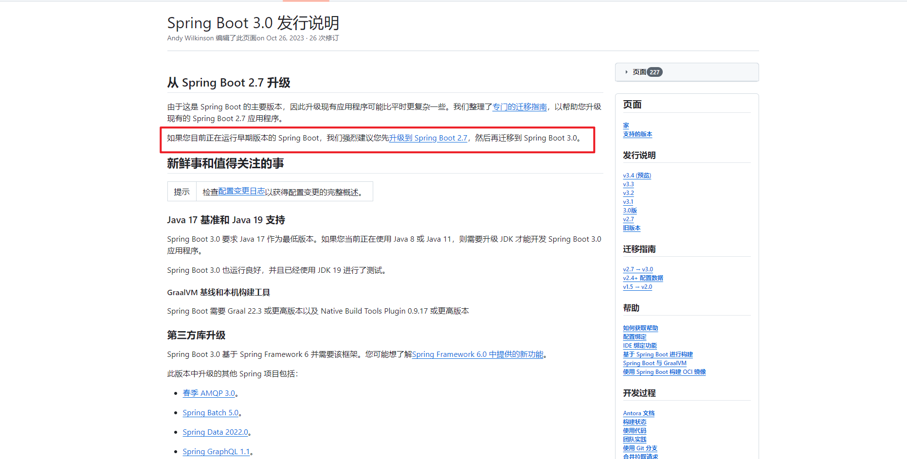
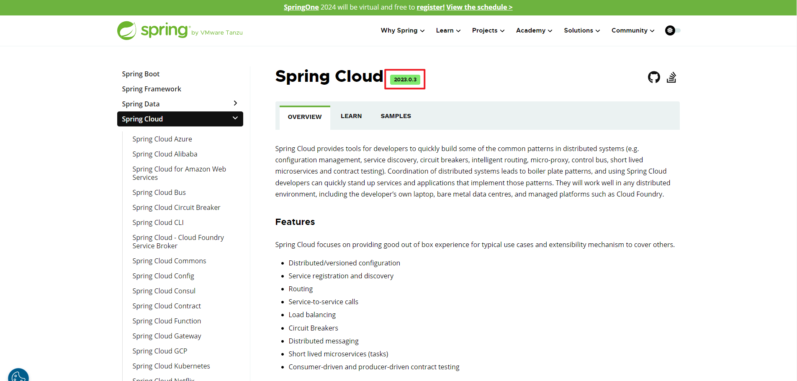
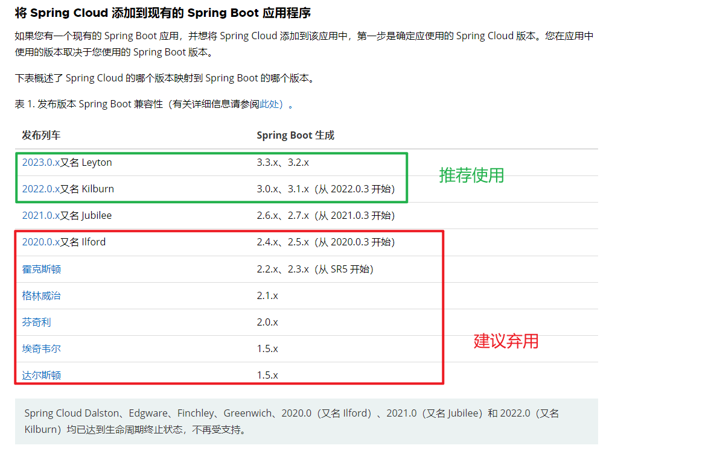
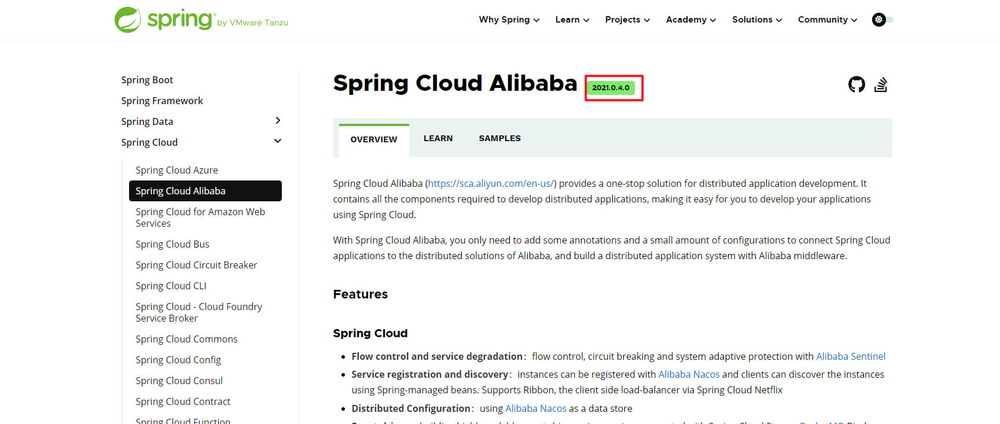
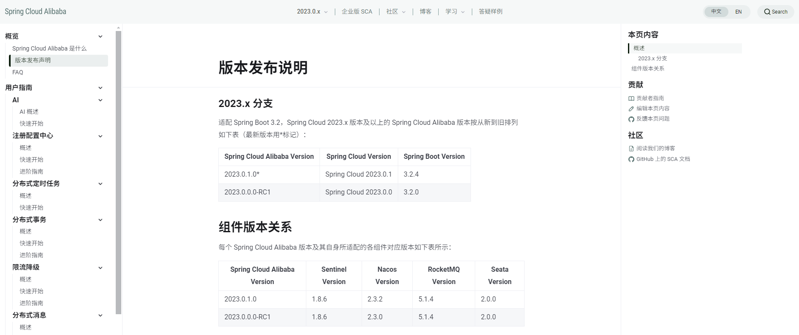
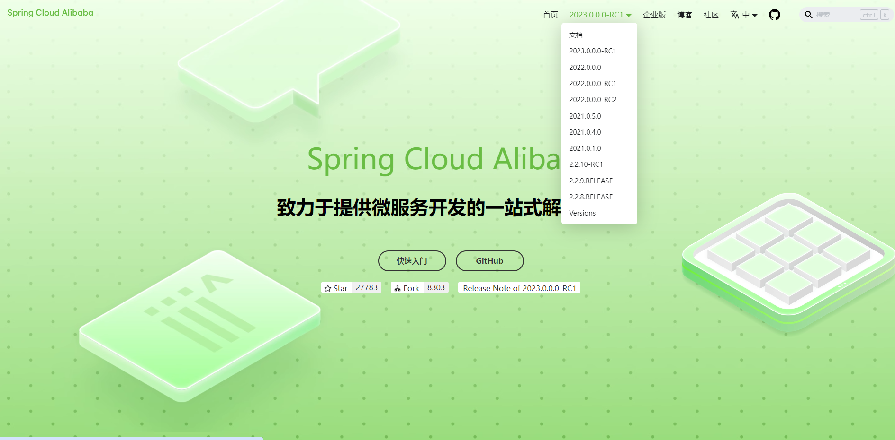

> 在线视频：[尚硅谷2024最新SpringCloud教程，springcloud从入门到大牛](https://www.bilibili.com/video/BV1gW421P7RD)
>
> 课程资料：[尚硅谷2024最新版SpringCloud教程](https://pan.baidu.com/s/1BHuY4SWHwFUNDilbzngjyQ?pwd=8kzj)
>
> 代码仓库
>
> Gitee: https://gitee.com/an_shiguang/learn-springcloud
>
> GitHub : https://github.com/Shiguang-coding/learn-springcloud

# 无伤速通版

- Java : `Java17+`
- Cloud : `2023.0.0`
- Spring Boot: `3.2.0`
- Spring Cloud Alibaba : `2022.0.0.0-RC2`
- Maven : `3.9+`
- Mysql: `8.0+`

# 详细推演版

> 分为上下两篇，SpringCloud与SpringCloud Alibaba，相互独立

## SpringBoot版本选择

> GitHub：https://github.com/spring-projects/spring-boot/releases/
> 官网：https://spring.io/projects/spring-boot

SpringBoot官方强烈建议使用Java17+升级到3X以上版本

详细内容详见：https://github.com/spring-projects/spring-boot/wiki/Spring-Boot-3.0-Release-Notes

## SpringCloud版本选择

> GitHub: https://github.com/spring-cloud
> 官网： https://spring.io/projects/spring-cloud

截至到2023年12月12（课程录制时间），Spring Cloud最新版本为 `2023.0.0`

截至到2024年9月12，SpringCloud最新版本为`2023.0.3`

### SpringCloud与SprongBoot版本依赖关系

### SpringCloud各版本命名规则

Spring Cloud 最初采用了英国伦敦地铁站的名称来命名，并由地铁站名称字母A-Z依次类推的形式来发布迭代版本

SpringCloud是一个由许多子项目组成的综合项目，各子项目有不同的发布节奏。为了管理SpringCloud与各子项目的版本依赖关系，发布了一个清单，其中包括了某个SpringCloud版本对应的子项目版本。为了避免SpringCloud版本号与子项目版本号混淆，SpringCloud版本采用了名称而非版本号的命名，这些版本的名字采用了伦敦地铁站的名字，根据字母表的顺序来对应版本时间顺序。例如Angel是第一个版本, Brixton是第二个版本。

当SpringCloud的发布内容积累到临界点或者一个重大BUG被解决后，会发布一个"service releases"版本，简称SRX版本，比如Greenwich.SR2就是SpringCloud发布的Greenwich版本的第2个SRX版本。

## Spring Cloud Alibaba版本选择

> GitHub : https://github.com/alibaba/spring-cloud-alibaba
> Spring官网： https://spring.io/projects/spring-cloud-alibaba
> Spring Cloud Alibaba 官网： 
>
> https://sca.aliyun.com/
> https://spring-cloud-alibaba-group.github.io/zh-cn/

查看最新版本应从Spring Cloud Alibaba官网查看，而非在Spring官网查看，Spring官网具有延后性

从课程录制时间到2024年9月13，Spring官网Spring Cloud Alibaba 最新版本为`2021.0.4.0`

### Spring Cloud Alibaba 最新版本发布声明

课程版本： [2022.0.0.0-RC2](https://spring-cloud-alibaba-group.github.io/zh-cn/docs/2022.0.0.0-RC2/overview/what-is-sca)

截至至2024年9月13最新版本： [2023.0.0.0-RC1](https://spring-cloud-alibaba-group.github.io/zh-cn/docs/2023.0.0.0-RC1/overview/what-is-sca)

## 最终定稿版本

> 版本适配匹配度，请严格依照官网

### Boot 、Cloud、Cloud Alibaba三者版本约束关系

1、若同时用Boot和Cloud，由话事人Cloud决定Boot版本

2、[Spring Cloud Alibaba 毕业版本依赖关系](https://sca.aliyun.com/docs/2022/overview/version-explain/)

### 课程定稿版本

- Java : `Java17+`
- Cloud : `2023.0.0`
- Spring Boot: `3.2.0`
- Spring Cloud Alibaba : `2022.0.0.0-RC2`
- Maven : `3.9+`
- Mysql: `8.0+`

